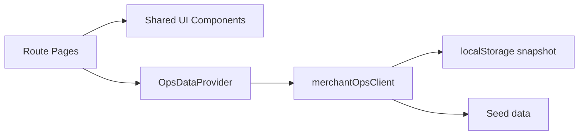

# Merchant Ops Studio

Merchant Ops Studio is an internal operations workspace for payment teams that need one place to monitor merchant health, review disputes, triage fraud or compliance signals, and control settlement releases.

It was designed around a simple operational problem: as payments teams grow, critical workflows become fragmented across separate tools. Support teams work in ticket queues, risk teams work in fraud dashboards, finance teams track payout exceptions in spreadsheets, and merchant teams keep notes elsewhere. The result is slow handoff, duplicate investigation work, and higher payout risk.

This project brings those workflows into a single operator-facing surface.

## Problem Statement

Merchant operations teams usually need to answer a small set of high-pressure questions:

- Which merchants need attention right now?
- Which disputes are close to breaching SLA?
- Which risk signals should block or delay payout?
- Which settlement batches are safe to release?

When those answers live in different systems, decisions slow down. Merchant Ops Studio is a response to that fragmentation.

## Solution Overview

The product is organized around operational decisions rather than abstract pages:

- `/` overview dashboard with KPI cards, throughput trend, risk watchlist, and live activity
- `/merchants` searchable merchant operations view with relationship ownership and account health
- `/disputes` action queue for review, refund, representment, and liability workflows
- `/risk` analyst assignment and signal triage board
- `/settlements` treasury-aware payout planning and hold/release controls
- `/playbook` system notes covering operating assumptions, architecture, and quality controls

## Thought Process

The frontend was shaped by a few product decisions:

- Start from operator workflows, not navigation labels. Each route is centered on a question an ops team actually needs to answer.
- Keep queue and context together. Lists, details, evidence, and actions sit on the same screen to reduce tab switching.
- Make state visible. Risk, dispute, settlement, and merchant health states use shared language and consistent status treatment.
- Treat backend integration as a boundary, not an afterthought. The mock client simulates latency and mutations so the UI behaves like a real system before a live API exists.
- Prefer shared primitives only where repetition is real. Components such as `Panel`, `Badge`, `MetricCard`, and `DataTable` exist because the same patterns recur across operations surfaces.

## Technical Approach

- Routing: `react-router-dom`
- State: typed context provider with async client actions and browser-local persistence
- Styling: custom CSS system with tokens and responsive layout primitives
- Data layer: a mock REST-style client that simulates latency and persists state in `localStorage`
- Testing: Vitest + Testing Library

## Architecture



The current implementation uses seeded operational data plus browser persistence because the first goal was validating the workflow model and UI behavior without introducing backend dependencies. Replacing the local client with live API calls should mostly be contained to `src/lib/merchantOpsClient.ts`.

## Running Locally

```bash
yarn install
yarn dev
```

Verification commands:

```bash
yarn lint
yarn test
yarn build
```

## Live Demo

The application is live at:

`https://jeffgicharu.github.io/merchant-ops-studio/`

## Notes

See [docs/product-rationale.md](./docs/product-rationale.md), [docs/architecture.md](./docs/architecture.md), [docs/component-guide.md](./docs/component-guide.md), and [docs/testing-plan.md](./docs/testing-plan.md) for the product and implementation notes.
